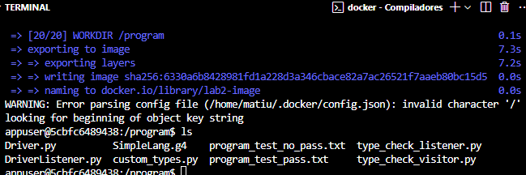
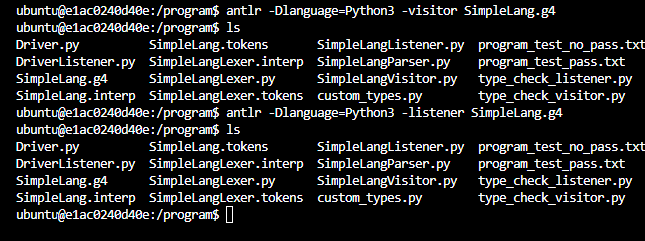
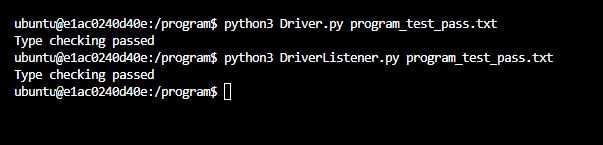
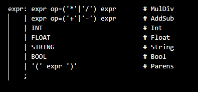
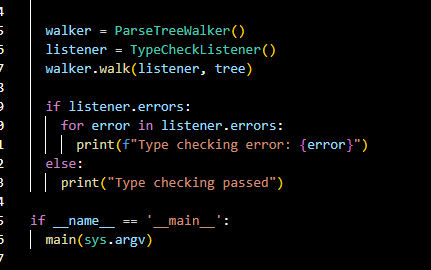
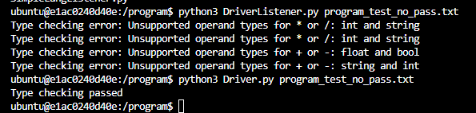
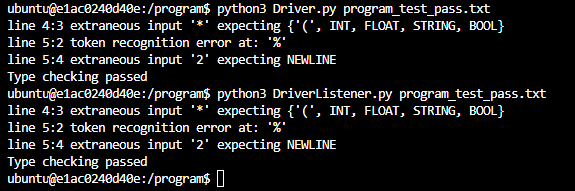
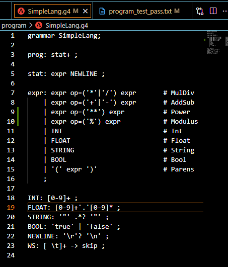

# 🧪 Laboratorio 2: Sistema de Tipos con ANTLR

Ejecutamos el comando para levantar el docker

Ahora generamos los archivos de lexer y parser

---
## Analisis de Archivos

### Archivo que pasa

Ahora ejecutamos el analizador, y probamos para ver que 

#### Justificacion

El porque si lo acepta bien por el Driver lister y el visitor es porque esta bien escrita la gramatica en el archivo de prueba pass, en esta se define que una expresion que puede ser definida por un intero, string, boolean o float puede estar acompañada entre los dos por un operador.

Debido a esta definicion si pasa correctamente ya que los archivos Driver y DriverLister esperan a que ocurra un error dado por sus listener y asi mostrar que no pudo pasar

### Archivos que no pasan

Ejecutamos el archivo "program_test_no_pass", y este nos genera lo siguiente

#### Justificacion

Aqui las cosas cambian porque con Driver no detecta error pero con el DriverListener si marca error , especificamente los errores que marca es que no podemos hacer divisiones con un enter y string, multiplicciones con entero y string, restas con flotante y booleano y sumas con string y numero. 

Esto se debe a como se define el sistema de tipos, en el archivo DriverLister.py se llama a TypeCheckListener, y si nos vamos a ese metodo , vemos que aqui se validan ese sistema de tipos, cosa que el driver no tiene.

El driver usa un visitor que lo que hace es visitar los nodos del arbol, en este solo se valida si el metodo  visitMulDiv o visitAddSub es llamado y las subexpresiones devuelven correctamente su tipo. Si por algún motivo se devuelve un tipo “aceptable” antes de tiempo, la validación nunca se dispara. En cambio el listener usa self.types para ver el tipo de cada subexpresion , lo que provoca que salte el error. Ya que guarda los tipos y luego al salir del nodo y compararlos con las funciones se da cuenta y lanza el error.

Osea el listener guarda toda la info que va recolentando de los hijos y el flujo de las entradas y salidas lo maneja ANTLR en cambio el visitor se tiene que especificar en que orden recorrer el hijo o no, y por ende ocurren cosas como esta.

---
## Extender Gramatica

Ahora agregaremos 2 operaciones mas la de modulo "%" y la de "**" que es la de potencia.

Sin implementar las reglas me da esto

Por lo que no sirve con % ni potencias , vamos a arreglarlo

---

Aqui agregamos las reglas de "Power" y "Modulus" en donde sirven para lo siguiente y tienen las siguientes restriccioens.

**Power**
- Restricciones de tipo: Ambos operandos deben ser de tipo numérico (IntType o FloatType).

- Resultado: Devuelve FloatType si alguno de los operandos es FloatType; en caso contrario, devuelve IntType.

**Modulus**
- Representa la operación módulo, que calcula el resto de la división entre dos números enteros.

- Restricciones de tipo:
Ambos operandos deben ser de tipo entero (IntType).

- Resultado:
Siempre devuelve un valor de tipo IntType.

## Agregar Validadores

